Asontus-Sitecore-nifties
========================

A Userscript for Tampermonkey (etc.) that adds some nifty functionality to the Sitecore client. Should work on Sitecore 8 and 9, best results are with Tampermonkey in Chrome but goal is to work with Greasemonkey and Firefox too.

- [Features](#features)
  - [See information directly in the header](#see-information-directly-in-the-header)
  - [Add buttons to the header](#add-buttons-to-the-header)
  - [Switch [master]<->[web] db and continue where you left off](#switch-master-web-db-and-continue-where-you-left-off)
  - [Open item from content-tree search directly](#open-item-from-content-tree-search-directly)
  - [Stay at the bottom when opening items](#stay-at-the-bottom-when-opening-items)
  - [Quickly scroll to the opened item](#quickly-scroll-to-the-opened-item)
  - [Open current item in the DB Browser](#open-current-item-in-the-db-browser)
  - [Open form in content editor](#open-form-in-content-editor)
  - [Export and import My Toolbar customization](#export-and-import-my-toolbar-customization)
- [Installation](#installation)

Features:
---------

### See information directly in the header

Quickly see which database and language you're working in. Customize per domain to quickly see which environment you're looking at:

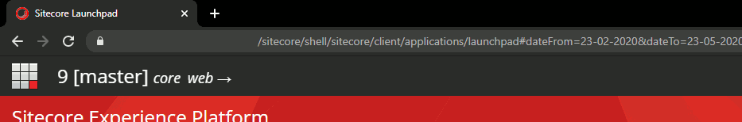

In the Content Editor and Experience Forms this information includes the selected language:

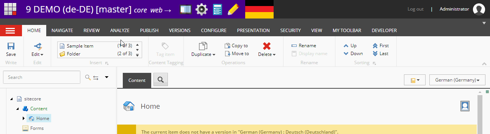

### Add buttons to the header

Add any button from the Launchpad to the header so you can more quickly switch between Sitecore features.

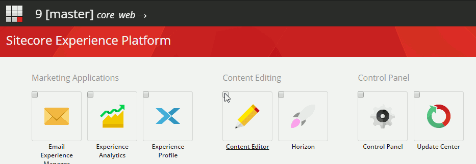

### Switch [master]<->[web] db and continue where you left off

When you click on the _master_, _web_ or _core_ buttons in the header, you continue to the feature where you were (rather than the desktop). If you do this in the Content Editor and you switch between _master_ and _web_, the content-tree state, opened item and selected language is preserved.

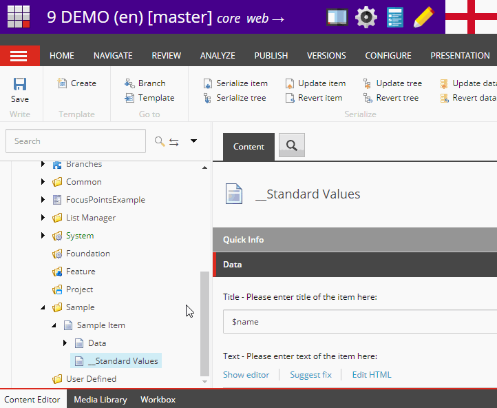

### Open item from content-tree search directly

If a search in the content-tree box yields only one item (for instance when you give a `GUID`), just open the item directly.

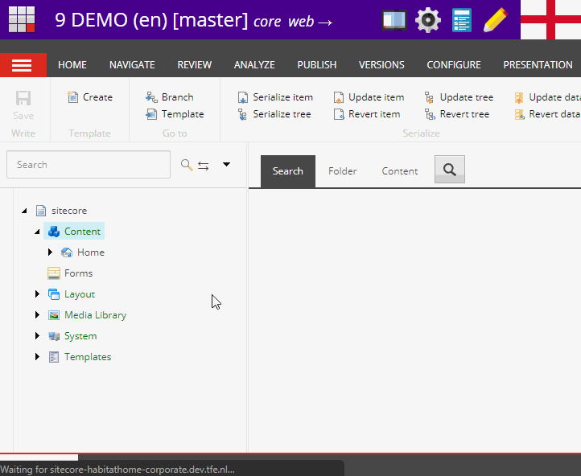

### Stay at the bottom when opening items

When you're scrolled to the very bottom of the content-tree and you open an item to view its sub-items, automatically scroll to the bottom.

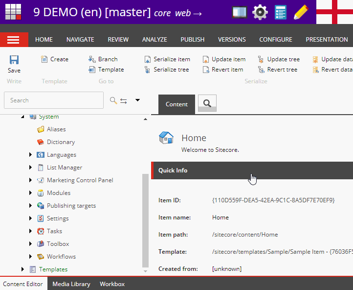

### Quickly scroll to the opened item

When you've opened an item in a different way than via the content-tree but you wanna see where in the tree it is, quickly go there with this button.

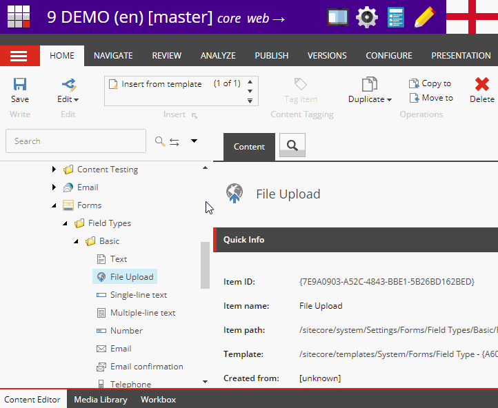

### Open current item in the DB Browser

A link is added after the item name to open the item in the DB Browser, respecting the current database and language.

### Open form in content editor

When you're editing a form and you wanna quickly open it in the Content Editor, use the pencil link. Works from newly created forms as soon as you've saved.

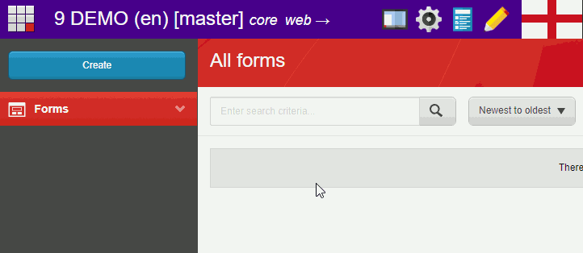

When you're in the overview of all your forms, pencils are added to both the form as well as the pages where the form is currently used. Use these to quickly go there in the content editor:

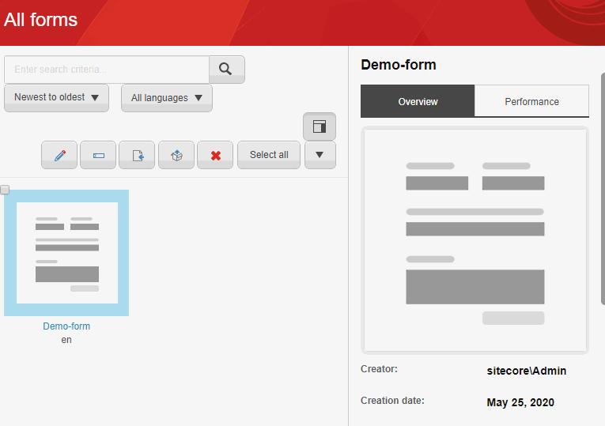

### Export and import My Toolbar customization

If you add buttons to Sitecore's "My Toolbar", you can copy it as a list of GUID's and import it in another Sitecore instance.

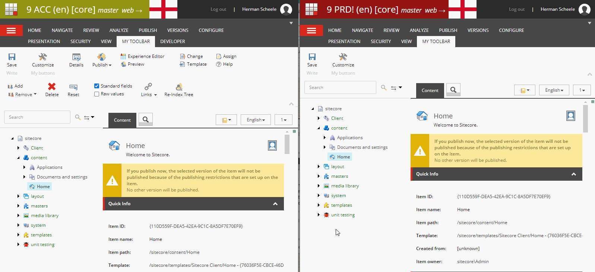

Installation
------------

1. Install [Tampermonkey](https://www.tampermonkey.net/) (or [Greasemonkey](https://addons.mozilla.org/en-US/firefox/addon/greasemonkey/) if you must)
2. Go to the [Raw view of the userscript](https://github.com/asontu/Asontus-Sitecore-nifties/raw/master/sitecore-nifties.user.js) and click install.
3. Add the url's for the Sitecore clients where you wanna use this userscript.
4. Optionally configure different Sitecore clients to be recognized as different environments, see the [first feature](#see-information-directly-in-the-header)

### Install demo

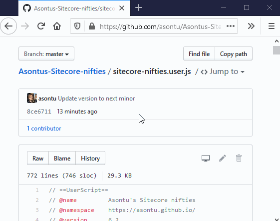